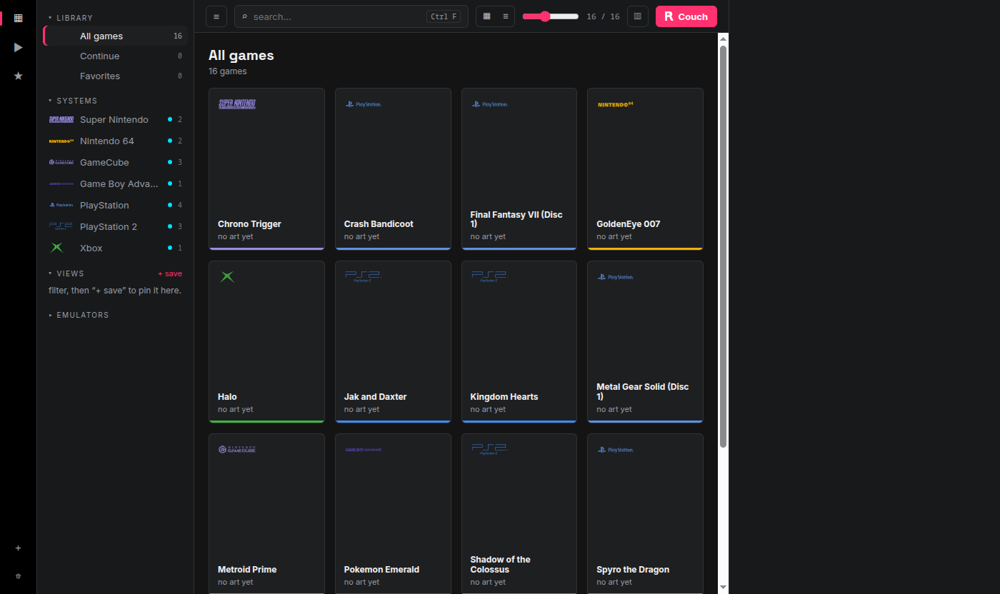
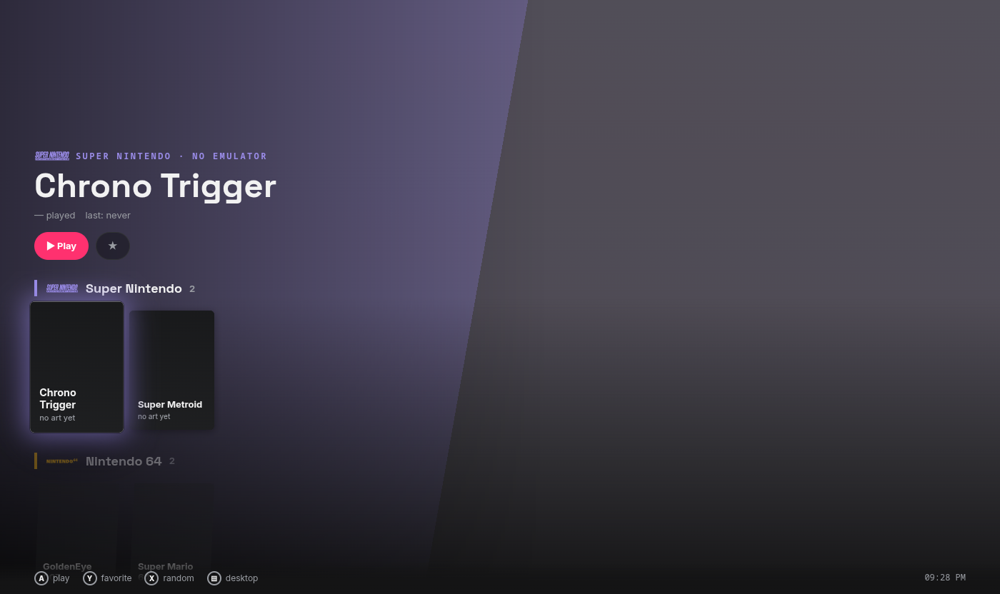

# REPRO

an emulator hub that actually does what you want. one folder, every emulator, every game, every save.




## what it does

- scans your whole PC for roms. finds them wherever they are, even if you move them later.
- detects your emulators automatically. dolphin, pcsx2, duckstation, xemu, xenia — just point and go.
- real save management. REPRO finds the saves your emulator actually writes (DuckStation per-game cards, PCSX2 memory cards, Dolphin GCI/raw cards + Wii saves, the xemu HDD) and snapshots them before and after every session, only when something changed. name a snapshot to keep it forever. every restore takes an undo point first, so you can't lose a save by restoring the wrong one. REPRO never rewrites your emulator's settings.
- pulls box art and descriptions from IGDB so your library looks like a library.
- couch mode for the TV, desktop mode for the PC. controller-navigated with a guide overlay (like the xbox button).
- portable. the whole thing runs from one folder. copy it anywhere, it works.
- windows and linux. native installs, AppImages and flatpaks all get detected.

## setup

download from [releases](../../releases):

- **windows**: `REPRO-x.y.z-portable.exe`. drop it in a folder, run it.
- **linux**: `REPRO-x.y.z-x86_64.AppImage`. drop it in a folder, `chmod +x`, run it.

either way, config, library, art and saves live in the folder next to it.

on first launch it'll scan for emulators and ask where your roms are. or hit **File → Scan whole PC** and let it find everything itself.

for box art, grab a free Twitch developer key at [dev.twitch.tv](https://dev.twitch.tv) and paste it into Settings → Art scraper. takes about 2 minutes.

## emulators

works with any emulator via recipe files. ships with:

| system | emulator | windows | linux |
|--------|----------|---------|-------|
| GameCube / Wii | Dolphin | ✓ | ✓ native, AppImage, flatpak |
| PS1 | DuckStation | ✓ | ✓ AppImage, flatpak |
| PS2 | PCSX2 | ✓ | ✓ native, AppImage, flatpak |
| Xbox | xemu | ✓ | ✓ native, AppImage, flatpak |
| Xbox 360 | Xenia | ✓ | — (no native build) |

on linux REPRO looks on your PATH, in `~/Applications`, `~/Games`, `/opt`, and in installed flatpaks. flatpak emulators get the rom folder and REPRO's saves folder passed into their sandbox at launch, so you don't need Flatseal.

add more by dropping a `.json` recipe in the `recipes/` folder.

## adding your own emulator

copy any existing file in `recipes/` and fill in the binary names (per os: `"exe": { "win": [...], "linux": [...] }`), the flatpak id if there is one, and the launch args. that's it.

## development

```
npm i
npm start           # run from source
npm test            # node --test, no display needed
npm run dist        # windows portable exe
npm run dist:linux  # linux AppImage
```

## themes

drop a folder into `themes/` with a `theme.css` and `theme.json`. three ship by default: billet, manual, crt.

## why

every existing launcher makes you configure everything by hand or locks you into their library format. REPRO just finds your stuff and gets out of the way.

## license

MIT
